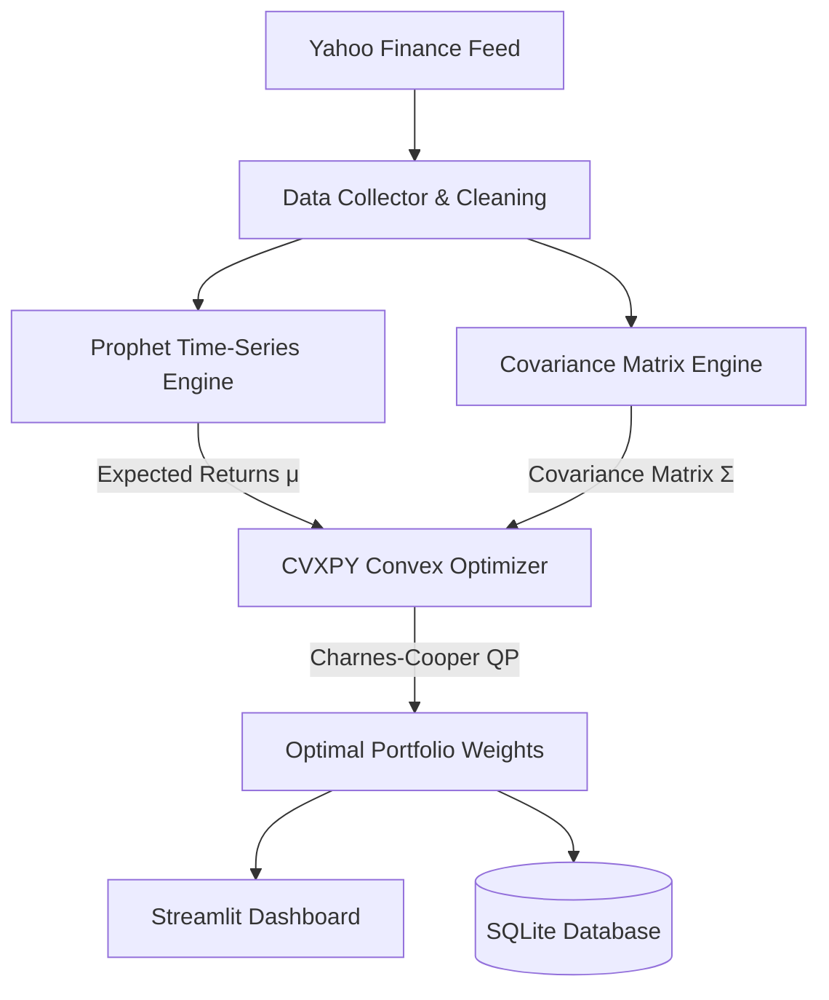

# Real-Time Stock Forecasting & Convex Portfolio Optimization

[](https://dl.circleci.com/status-badge/redirect/circleci/GDyfJvLbK1Mho7C82AmdaY/UyqqHUoXUqfbc7NnbXrVnk/tree/main)


An enterprise-grade quantitative finance platform combining **Bayesian structural time-series forecasting** (Prophet) with **Convex Modern Portfolio Theory** (CVXPY). Built under strict production gates: deterministic dependency management, static type safety, automated linting, containerization, and continuous integration.

---

## System Architecture



---

## Quality Engineering & CI Gates

* **Dependency Management**: Fully locked, reproducible environments using `Poetry`.
* **Linting & Code Quality**: Enforced via `Ruff`.
* **Static Type Safety**: 100% typed interfaces verified via `Mypy`.
* **Automated Testing**: Complete constraint validation via `pytest`.
* **CI/CD Automation**: Automated multi-stage test pipeline running on `CircleCI`.

---

## Quickstart

### 1. Local Development
```bash
# Install dependencies
poetry install

# Run static quality analysis
poetry run ruff check src/ tests/
poetry run mypy src/

# Run unit tests
poetry run pytest --cov=src/stock_portfolio -v

# Launch the dashboard
poetry run streamlit run src/stock_portfolio/app/dashboard.py
```

### 2. Docker Execution
```bash
docker build -t stock-portfolio-app:latest .
docker run -d -p 8501:8501 --name stock-app stock-portfolio-app:latest
```
Access the application at `http://localhost:8501`.
